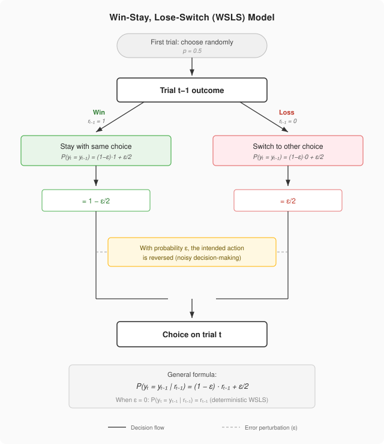
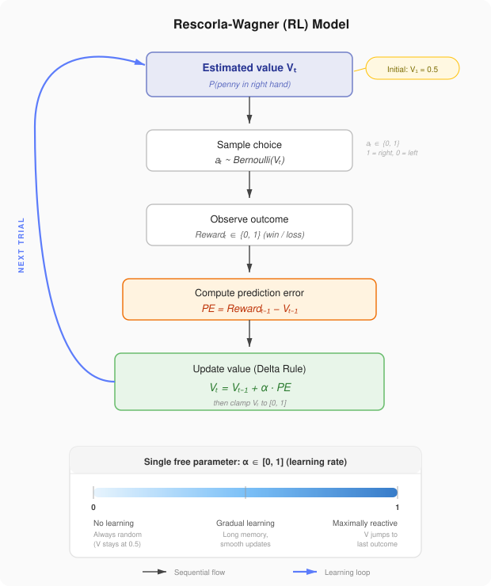

# Advanced Cognitive Modelling — Project 1

This repository contains materials for the first assignment in the Advanced Cognitive Modelling course. All code and analysis live in the R Markdown file, with supporting assets stored under `out/`.

## The Matching Pennies Task

This project compares two agents in a matching pennies setting:
- **Win-Stay-Lose-Shift (WSLS)**
- **Reinforcement Learning (RL)**

In short, WSLS is a one-step strategy with minimal memory, while RL gradually updates a belief state from feedback.

## Project Structure
- `ACM_P1.Rmd`: Main R Markdown notebook for the assignment.
- `out/`: Generated figures, tables, and other assets.

## Model 1: Probabilistic WSLS Agent

### Verbal description
If the agent observes a **win**, it stays with the previous option. If it observes a **loss**, it shifts to the alternative option. This makes WSLS a one-step memory strategy with no persistent internal state beyond the previous trial.

The probabilistic WSLS version adds an error/noise parameter, so the agent can deviate from the deterministic rule and choose randomly.

In the current implementation in `ACM_P1.Rmd`, $\epsilon$ is fixed to $0.1$ during simulation.

### Formal description
Let $r_{t-1} \in \{0,1\}$ denote feedback from the previous trial ($1=\text{win}$, $0=\text{loss}$).

Let $y_t \in \{0,1\}$ denote the agent's choice on trial $t$.

Let $\epsilon \in [0,1]$ denote the error probability.

Deterministic WSLS rule:

$$
P(y_t = y_{t-1} \mid r_{t-1}) = r_{t-1}
$$

Probabilistic policy:

$$
P(y_t = y_{t-1} \mid r_{t-1}) = (1-\epsilon)\,r_{t-1} + \frac{\epsilon}{2}
$$

When $\epsilon = 0$, the model reduces to deterministic WSLS.

## Model 2: RL Agent

### Verbal description
The RL agent tracks a belief about outcomes and updates that belief based on prediction error. It starts unbiased and revises its expectation trial-by-trial using a learning rate.

In the current simulation loop in `ACM_P1.Rmd`, the learning rate is set to $\alpha = 0.5$.

### Formal description
Let $a_t \in \{0,1\}$ denote the agent's choice on trial $t$, where $1=\text{right}$ and $0=\text{left}$.

Let $V_t \in [0,1]$ denote the agent's estimated value (probability of winning) at trial $t$.

Let $Reward_t \in \{0,1\}$ denote the trial outcome, where $1=\text{win}$ and $0=\text{loss}$.

Let $\alpha \in [0,1]$ denote the learning rate.

Belief update:

$$
V_t = V_{t-1} + \alpha\big(Reward_{t-1} - V_{t-1}\big)
$$

Choice rule:

$$
a_t \sim \text{Bernoulli}(V_t), \quad V_1 = 0.5
$$

Here, $(Reward_{t-1} - V_{t-1})$ is the prediction error.

After updates, $V_t$ is bounded to $[0,1]$ to remain a valid probability.

Parameter interpretation:
- $\alpha = 0$: no updating, random behavior persists.
- $\alpha = 1$: maximal reactivity to most recent outcome.
- $0 < \alpha < 1$: graded sensitivity to new evidence.

## Diagnostic Visualizations

The model diagrams are included above in each model section. Add additional generated plots to `out/` (e.g., performance curves, choice traces) and link them here as they are finalized.

## Discussion: Cognitive Constraints

### WSLS cognitive constraints
- Requires minimal memory (previous action + previous outcome only).
- Outperforms pure randomness by adapting to immediate feedback.
- Does not build a richer internal model of opponent tendencies.
- The noise term can reflect attentional lapses, motor noise, or imperfect rule execution.

### RL cognitive constraints
- Uses memory-dependent belief updating rather than pure one-step switching.
- Explicitly computes prediction error and updates strategy proportionally.
- Learning-rate weighting controls how strongly recent outcomes dominate behavior.
- In matching pennies, this shapes strategic stability, volatility, and exploitability.

### Outcome and implications
The relative performance of WSLS and RL depends on parameterization and interaction dynamics. In this project, the comparison is used to discuss how simple heuristic adaptation (WSLS) contrasts with incremental belief-based adaptation (RL) under realistic cognitive constraints.
